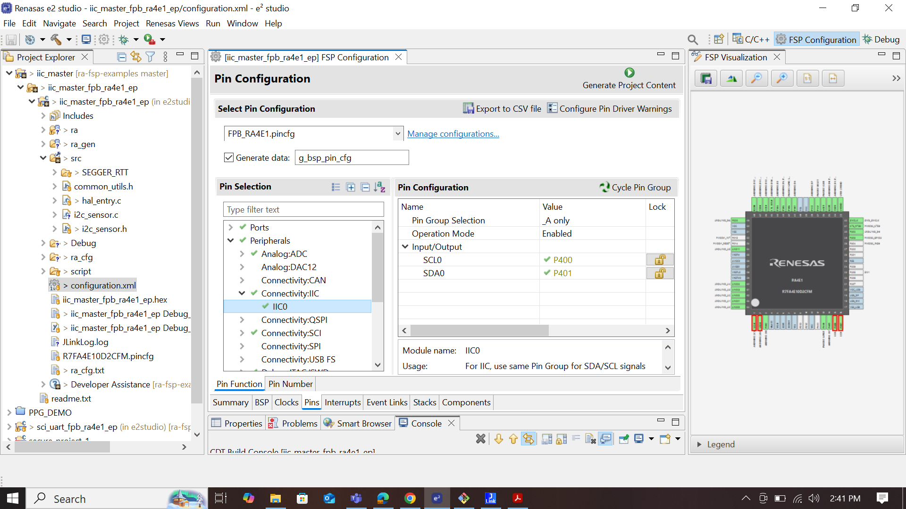
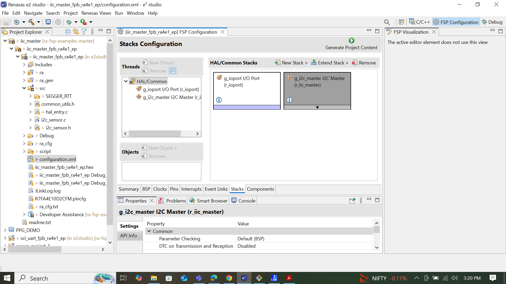
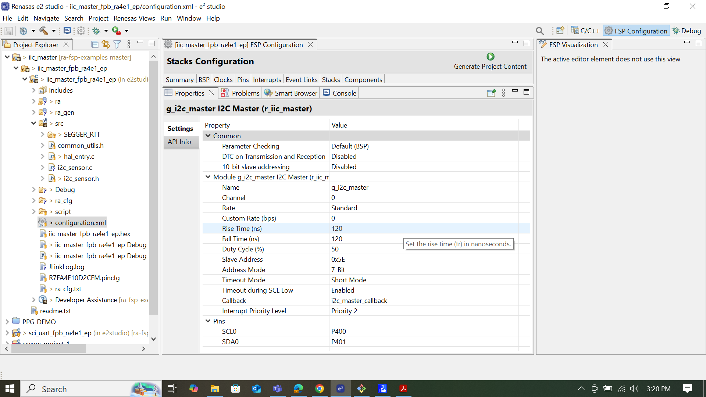

# PPG Project details:

This is the repository which contains PPG project documents, microcontroller firmware code.

| Supported Targets | FPB-RA4E1 | 
| :----------------- | :--------- |

## Hardware detail:
This example can be executed on RENESAS FPBRA4E1(R7FA4E10D2CFM), the only required using i2c interface with MAX86150 extranl sensor.

### "Checkout about MAX86150" [Click here](https://github.com/Protocentral/protocentral_max86150_ecg_ppg/blob/master/README.md)

 |MAX86150 pin label| RA4E1 Connection  |Pin Function      |
 |:-----------------: |:---------------------:|:------------------:|
 | SDA              | SDA                  |  Serial Data     |
 | SCL              | SCL                  |  Serial Clock    |
 | 3.3V             | 3.3V                 |  Power           |
 | GND              | GND                  |  GND             |
 | INT              | --                   |  Interrupt        |

## Software detail:
1)In this example  configuration of iic_master is important to communicate with max86150 sensore as showing above pin 
  configuration in harware details.
  

  
2)checkout how to setup the iic in the e2studio check out here. 

i) pin configuration as show in the below picture 

ii)iic configuration as show in the below picture 

iii) stacks properties

## IDE Information :

### "Checkout about e2studio" [Click here](https://www.renesas.com/en/software-tool/e-studio?srsltid=AfmBOoofsyZ-vZtebnAy63cVHOU4tqkWEnhXESOGg8qhTQyPTHtpYvmC)
